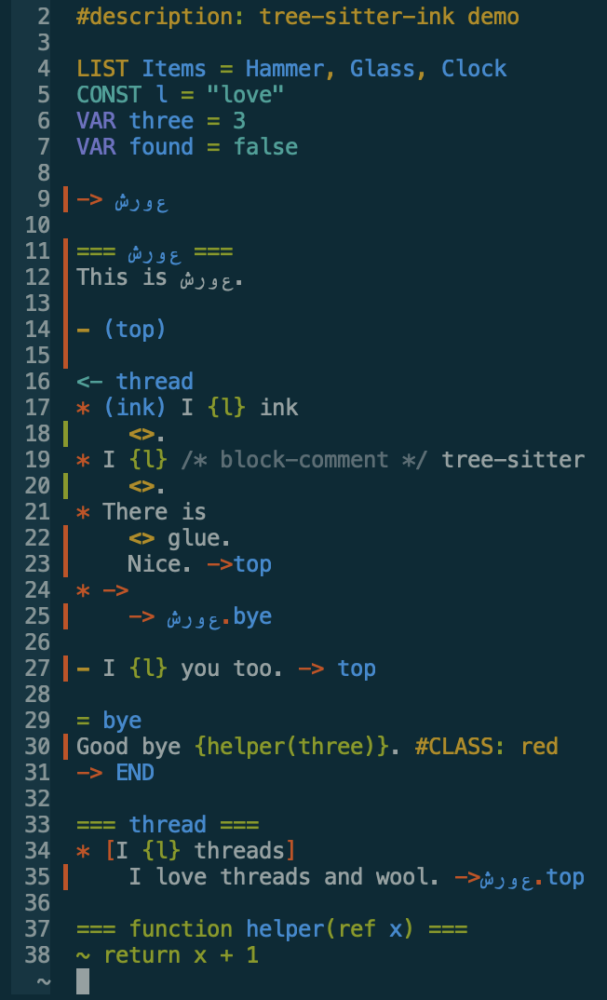

# tree-sitter-ink

tree-sitter grammar for [ink by inkle](https://github.com/inkle/ink) with full
unicode support.



## State

It currently does not parse code and conditions further, but I plan to implement
this. First I am working on a language-server based on tree-sitter-ink with the
goal of having an IDE with full unicode support.

## Install for helix

Edit `hx ~/.config/helix/languages.toml` and replace `$long_revision`.

```toml
[[language]]
name = "ink"
scope = "source.ink"
injection-regex = "ink"
file-types = ["ink"]
comment-token = "//"
block-comment-tokens = { start = "/*", end = "*/"}
#language-servers = ["linky"]
indent = { tab-width = 4, unit = "\t" }
soft-wrap = { enable = true }
grammar = "ink"

[[grammar]]
name = "ink"
source = { git = "~/Repos/tree-sitter-ink", rev = "$long_revision" }
```

Copy the `highlights.scm` from this repo and install latest grammars.

```shell
mkdir -p ~/.config/helix/runtime/queries/ink
cp queries/highlights.scm ~/.config/helix/runtime/queries/ink/
hx --grammar fetch && hx --grammar build
hx assets/demo.ink
```

## License

I use standard rust style APACHE/MIT dual licensing.
